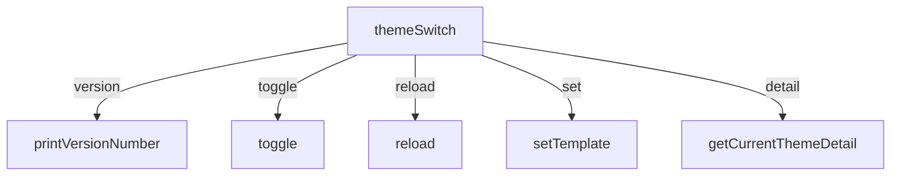

# theme switch flow

```mermaid
graph TD;

themeSwitch --> |version|printVersionNumber;
themeSwitch --> |toggle|toggle;
themeSwitch --> |reload|reload;
themeSwitch --> |set|setTemplate;
themeSwitch --> |detail|getCurrentThemeDetail;


```
